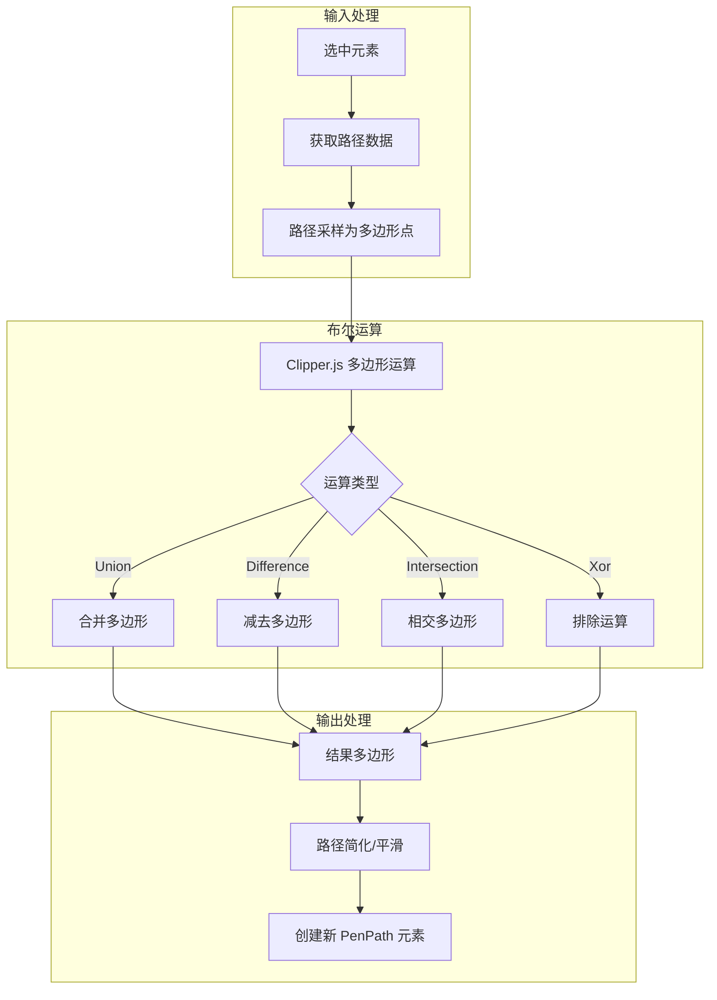

# 布尔运算实现方案

## 技术背景分析

### 现有技术栈

项目中已有以下可复用的技术：

1. **路径采样工具** ([bezier-utils.ts](packages/drawnix/src/plugins/pen/bezier-utils.ts))

   - `getPathSamplePoints()` - 将贝塞尔路径采样为点数组
   - `cubicBezierPoint()` - 计算曲线上的点

2. **多边形操作** ([freehand/utils.ts](packages/drawnix/src/plugins/freehand/utils.ts))

   - `isPointInPolygon()` - 判断点是否在多边形内（来自 @plait/core）
   - `distanceToSegment()` - 点到线段距离

3. **路径生成** ([pen.generator.ts](packages/drawnix/src/plugins/pen/pen.generator.ts))

   - `generatePathFromAnchors()` - 从锚点生成 SVG path
   - 支持贝塞尔曲线和闭合路径

4. **间接依赖**

   - `d3-polygon@3.0.1` 在 pnpm-lock.yaml 中存在（@plait/core 的依赖）

## 推荐方案：路径采样 + Clipper.js 多边形布尔运算

### 方案架构



### 技术选型

**推荐使用 `js-clipper` 或 `clipper2-js`：**

- 专门用于多边形布尔运算
- 包体积小（~50KB gzipped）
- 支持 Union、Difference、Intersection、Xor 四种运算
- 支持多边形偏移（offset）操作
- 无其他依赖

### 实现步骤

#### 步骤 1：添加依赖

```bash
pnpm add js-clipper
# 或使用更现代的版本
pnpm add clipper2-js
```

#### 步骤 2：创建路径转换工具

在 [transforms/boolean.ts](packages/drawnix/src/transforms/boolean.ts) 中添加：

```typescript
// 将元素转换为多边形点数组
function elementToPolygon(board: PlaitBoard, element: PlaitElement): Point[] {
  // 1. 获取元素的路径数据
  // 2. 使用 getPathSamplePoints() 采样
  // 3. 返回多边形点数组
}

// 将多边形点数组转换为 PenPath 元素
function polygonToPenPath(points: Point[], options: PenPathOptions): PenPath {
  // 使用 Douglas-Peucker 算法简化点
  // 转换为 PenAnchor 数组
  // 创建新的 PenPath 元素
}
```

#### 步骤 3：实现布尔运算函数

```typescript
import ClipperLib from 'js-clipper';

// 减去运算
async function booleanSubtract(board: PlaitBoard) {
  const elements = getSelectedElements(board);
  const basePolygon = elementToPolygon(board, elements[0]);
  const clipPolygons = elements.slice(1).map(e => elementToPolygon(board, e));
  
  const clipper = new ClipperLib.Clipper();
  clipper.AddPath(basePolygon, ClipperLib.PolyType.ptSubject, true);
  clipPolygons.forEach(p => {
    clipper.AddPath(p, ClipperLib.PolyType.ptClip, true);
  });
  
  const result = new ClipperLib.Paths();
  clipper.Execute(ClipperLib.ClipType.ctDifference, result);
  
  // 转换结果并插入画布
  const newElement = polygonToPenPath(result[0]);
  // ...
}
```

#### 步骤 4：处理特殊情况

- **曲线精度**：采样密度根据曲线长度动态调整
- **多个结果多边形**：布尔运算可能产生多个独立区域
- **路径平滑**：对结果应用 Douglas-Peucker 简化 + 贝塞尔拟合

### 各布尔运算对应的 Clipper 操作

| 功能 | Clipper 操作 | 说明 |

|-----|-------------|------|

| 减去 | `ctDifference` | 从第一个形状减去其他形状 |

| 相交 | `ctIntersection` | 保留重叠区域 |

| 排除 | `ctXor` | 保留非重叠区域 |

| 扁平化 | `ctUnion` + 简化 | 合并所有路径并简化为单一轮廓 |

### 需要修改的文件

1. **[transforms/boolean.ts](packages/drawnix/src/transforms/boolean.ts)** - 重写布尔运算实现
2. **[plugins/pen/bezier-utils.ts](packages/drawnix/src/plugins/pen/bezier-utils.ts)** - 可能需要添加路径简化函数
3. **[package.json](package.json)** - 添加 clipper 依赖

### 备选方案

**方案 B：Canvas globalCompositeOperation**

- 使用 Canvas 的 `source-out`、`source-in`、`xor` 等混合模式
- 优点：无需额外依赖
- 缺点：输出为栅格图像，非矢量

**方案 C：集成 paper.js**

- 优点：功能最完整，原生支持贝塞尔曲线
- 缺点：包较大（~200KB），需要更多适配工作

### 风险和注意事项

1. **精度问题**：曲线采样会损失精度，需要选择合适的采样密度
2. **性能问题**：复杂路径的采样和运算可能较慢，考虑添加 loading 状态
3. **边界情况**：相切、重叠、自相交等情况需要特殊处理
4. **撤销支持**：确保操作可以被正确撤销