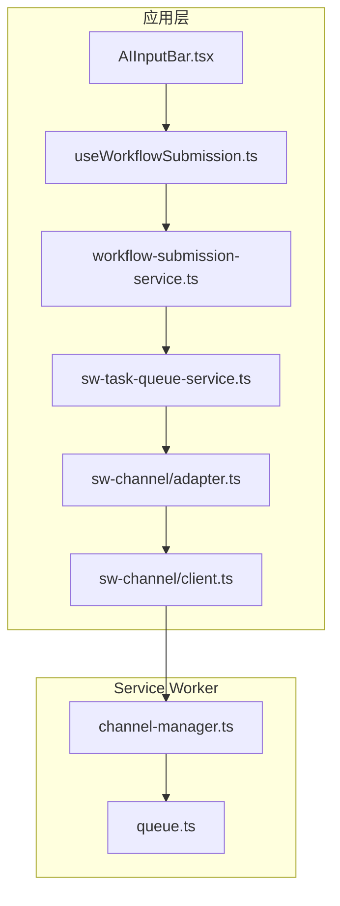
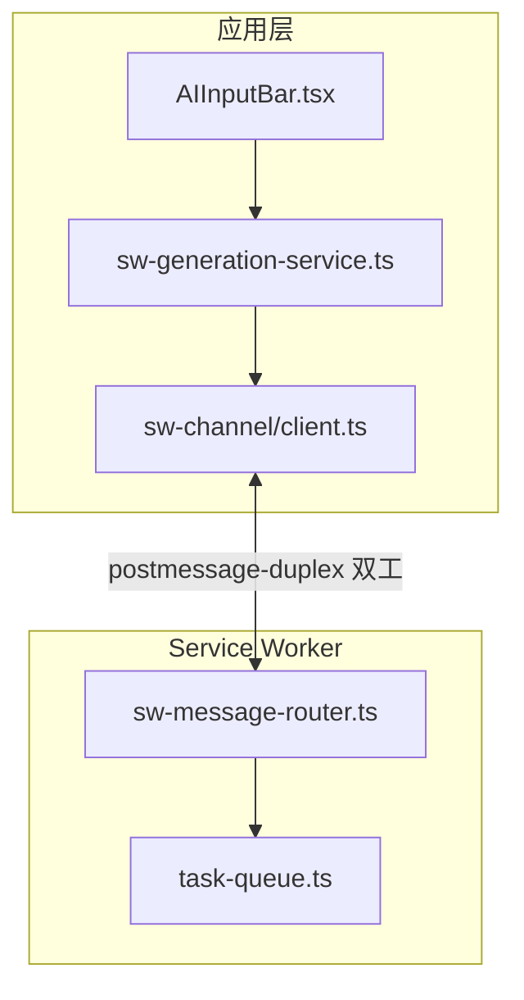
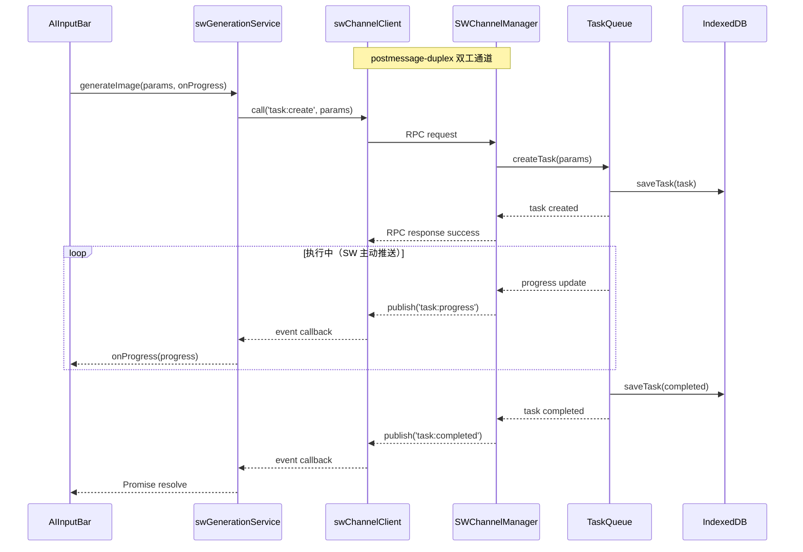

# 简化 Service Worker 通信架构（保留双工通信）

## 当前问题

当前从应用层到 SW 生成图片/视频的调用链有 7 层：



问题：

- postmessage-duplex 库与原有 postMessage 机制混用，消息路由混乱
- 层级太多（7 层），adapter 适配层冗余
- channel-manager 的通道创建时机和订阅注册有 bug（消息到达时订阅还未生效）

## 简化目标（保留双工通信）



优势：

- 层级从 7 层减少到 4 层
- 保留 postmessage-duplex 双工通信，SW 可主动推送进度和完成通知
- 移除冗余的 adapter 适配层

## 核心变更

### 1. 修复 SW 消息路由

当前问题：SW 的 message 事件监听器与 postmessage-duplex 通道的消息监听器冲突，导致消息被"拦截"后通道无法正确处理。

修复方案：在 `apps/web/src/sw/index.ts` 中，不要手动路由 duplex 消息，让 postmessage-duplex 通道自己处理：

```typescript
// 当前代码（有问题）
sw.addEventListener('message', (event) => {
  if (event.data.__key__ || event.data.requestId) {
    channelManager.handleMessage(event); // 手动路由导致问题
    return;
  }
  // ...
});

// 修复后
// postmessage-duplex 通道在创建时会自动设置消息监听器
// 不需要手动路由，只需要确保通道在客户端连接时就创建好
```

### 2. 简化 SW 端通道管理

重构 `apps/web/src/sw/task-queue/channel-manager.ts`：

关键改变：使用 `createFromWorker` 在客户端首次连接时就创建通道并注册所有订阅，而不是等 RPC 消息到达时才创建。

```typescript
export class SWChannelManager {
  private channels = new Map<string, ServiceWorkerChannel>();
  
  // 当检测到新客户端时立即创建通道
  ensureChannel(clientId: string): ServiceWorkerChannel {
    if (!this.channels.has(clientId)) {
      const channel = ServiceWorkerChannel.createFromWorker(clientId, {
        subscribeMap: {
          'task:create': (req) => this.handleTaskCreate(clientId, req),
          'task:cancel': (req) => this.handleTaskCancel(clientId, req),
          // ...其他 RPC 处理器
        },
      });
      this.channels.set(clientId, channel);
    }
    return this.channels.get(clientId)!;
  }
  
  // SW 向客户端推送事件
  publishToClient(clientId: string, event: string, data: any) {
    const channel = this.channels.get(clientId);
    channel?.publish(event, data);
  }
  
  // 广播给所有客户端
  broadcast(event: string, data: any) {
    this.channels.forEach(channel => channel.publish(event, data));
  }
}
```

### 3. 新建简化的生成服务

创建 `packages/drawnix/src/services/sw-generation-service.ts`：

```typescript
import { swChannelClient } from './sw-channel/client';

class SWGenerationService {
  private pendingTasks = new Map<string, { 
    resolve: (result: TaskResult) => void;
    reject: (error: Error) => void;
    onProgress?: (progress: number) => void;
  }>();
  
  constructor() {
    this.setupEventListeners();
  }
  
  async generateImage(
    params: ImageParams, 
    onProgress?: (progress: number) => void
  ): Promise<TaskResult> {
    const taskId = generateTaskId();
    
    return new Promise((resolve, reject) => {
      this.pendingTasks.set(taskId, { resolve, reject, onProgress });
      
      // 直接调用 client 的 RPC 方法
      swChannelClient.call('task:create', {
        taskId,
        type: 'image',
        params,
      }).then(response => {
        if (!response.success) {
          this.pendingTasks.delete(taskId);
          reject(new Error(response.error));
        }
        // 成功创建，等待 task:completed 事件
      }).catch(err => {
        this.pendingTasks.delete(taskId);
        reject(err);
      });
    });
  }
  
  async generateVideo(
    params: VideoParams,
    onProgress?: (progress: number) => void
  ): Promise<TaskResult> {
    // 类似 generateImage
  }
  
  // 监听 SW 推送的事件（双工通信的核心优势）
  private setupEventListeners() {
    // SW 主动推送进度更新
    swChannelClient.subscribe('task:progress', (data) => {
      const pending = this.pendingTasks.get(data.taskId);
      pending?.onProgress?.(data.progress);
    });
    
    // SW 主动推送完成通知
    swChannelClient.subscribe('task:completed', (data) => {
      const pending = this.pendingTasks.get(data.taskId);
      if (pending) {
        pending.resolve(data.result);
        this.pendingTasks.delete(data.taskId);
      }
    });
    
    // SW 主动推送失败通知
    swChannelClient.subscribe('task:failed', (data) => {
      const pending = this.pendingTasks.get(data.taskId);
      if (pending) {
        pending.reject(new Error(data.error));
        this.pendingTasks.delete(data.taskId);
      }
    });
  }
}

export const swGenerationService = new SWGenerationService();
```

### 4. 简化 AIInputBar 调用

修改 `packages/drawnix/src/components/ai-input-bar/AIInputBar.tsx`：

```typescript
// 之前：7 层调用链
const { submitWorkflow } = useWorkflowSubmission();
await submitWorkflow(parsedParams, referenceImages, retryContext, workflow);

// 之后：直接调用生成服务
import { swGenerationService } from '../../services/sw-generation-service';

// 对于直接生成（非 Agent 模式）
if (parsedParams.generationType === 'image') {
  const result = await swGenerationService.generateImage({
    prompt: parsedParams.prompt,
    model: parsedParams.modelId,
    size: parsedParams.size,
    count: parsedParams.count,
  }, (progress) => {
    // 更新 WorkZone 进度显示
    workflowControl.updateProgress(progress);
  });
  
  // 处理结果（插入画布等）
  handleGenerationResult(result);
}
```

### 5. 删除/简化的文件

| 文件 | 处理方式 |

|------|----------|

| `sw-channel/adapter.ts` | **删除**，直接使用 client.ts |

| `sw-task-queue-service.ts` | **简化**，只保留任务列表查询和状态订阅 |

| `workflow-submission-service.ts` | **简化**，移除 SW 提交逻辑 |

| `useWorkflowSubmission.ts` | **简化**，Agent 模式内部调用 swGenerationService |

## 双工通信流程



## 关键优势

1. **双工通信**：SW 可主动推送进度和完成通知，无需轮询
2. **层级简化**：从 7 层减少到 4 层
3. **类型安全**：保留 postmessage-duplex 的 TypeScript 类型支持
4. **请求-响应模式**：RPC 调用获得确认，避免消息丢失
5. **事件订阅**：支持多个监听者（任务列表 UI、WorkZone 等）同时监听状态变化

## 实施步骤

1. **修复 SW 消息路由**

   - 修改 `apps/web/src/sw/index.ts`，移除手动 duplex 消息路由
   - 重构 `channel-manager.ts`，使用 `createFromWorker` 预创建通道

2. **简化应用层**

   - 创建 `sw-generation-service.ts`
   - 删除 `adapter.ts`
   - 简化 `sw-task-queue-service.ts`（只保留查询功能）

3. **更新调用方**

   - 修改 `AIInputBar.tsx` 使用 swGenerationService
   - 修改 `useWorkflowSubmission.ts`，Agent 模式内部调用 swGenerationService

4. **清理**

   - 删除所有调试日志
   - 移除废弃代码