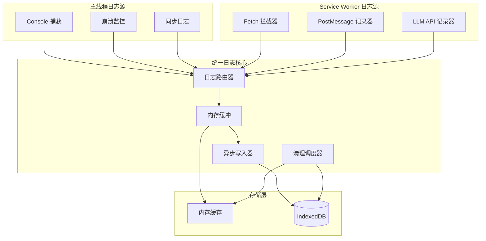

# 统一日志系统设计方案

## 现状分析

当前有 6 种独立的日志系统：


| 日志类型         | 存储位置           | 持久化 | 容量限制        | 清理策略     |
| ------------ | -------------- | --- | ----------- | -------- |
| Fetch 请求     | SW 内存          | 否   | 500 条       | 优先保留错误   |
| Console      | 内存 + IndexedDB | 是   | 500 / 7天    | 7天过期     |
| PostMessage  | SW 内存          | 否   | 500 条       | 调试关闭时清空  |
| LLM API      | 内存 + IndexedDB | 是   | 50 / 1000 条 | 按数量清理    |
| Crash/Memory | IndexedDB      | 是   | 50 条        | 按数量清理    |
| Sync (新增)    | IndexedDB      | 是   | 5000 条 / 7天 | 按时间+数量清理 |


## 统一架构设计




## 核心设计原则

### 1. 零性能影响

- **Fire-and-forget 模式**：所有日志调用立即返回，不 await
- **批量写入**：累积日志后批量写入 IndexedDB（500ms 间隔）
- **条件记录**：调试模式关闭时，仅记录关键日志（error 级别）
- **内存优先**：热数据保持在内存，持久化异步进行

```typescript
// 示例：零阻塞日志调用
export function log(category: LogCategory, level: LogLevel, message: string, data?: unknown): void {
  // 条件检查：调试模式关闭时仅记录 error
  if (!debugModeEnabled && level !== 'error') return;
  
  // 同步写入内存缓冲（微秒级）
  logBuffer.push({ category, level, message, data, timestamp: Date.now() });
  
  // 调度批量写入（不阻塞）
  scheduleBatchWrite();
}
```

### 2. 统一日志接口

```typescript
// 统一日志条目结构
interface UnifiedLogEntry {
  id: string;
  timestamp: number;
  category: 'fetch' | 'console' | 'postmessage' | 'llmapi' | 'crash' | 'sync';
  level: 'debug' | 'info' | 'success' | 'warning' | 'error';
  message: string;
  data?: Record<string, unknown>;
  sessionId?: string;
  duration?: number;
  error?: { name: string; message: string; stack?: string };
}

// 统一日志配置
interface LogCategoryConfig {
  memoryLimit: number;        // 内存缓存上限
  persistToDB: boolean;       // 是否持久化
  dbLimit?: number;           // IndexedDB 上限
  retentionDays?: number;     // 保留天数
  debugModeOnly?: boolean;    // 是否仅调试模式记录
}
```

### 3. 分类配置


| 类别          | 内存限制 | 持久化 | DB限制 | 保留天数 | 仅调试模式    |
| ----------- | ---- | --- | ---- | ---- | -------- |
| fetch       | 500  | 否   | -    | -    | 是        |
| console     | 500  | 是   | 5000 | 7    | 否(warn+) |
| postmessage | 500  | 否   | -    | -    | 是        |
| llmapi      | 50   | 是   | 1000 | 30   | 否        |
| crash       | 50   | 是   | 100  | 30   | 否        |
| sync        | 200  | 是   | 5000 | 7    | 否        |


## 实现方案

### Phase 1: 创建统一日志核心模块

创建 `packages/drawnix/src/services/unified-log-service.ts`：

```typescript
// 统一日志服务
class UnifiedLogService {
  private buffer: UnifiedLogEntry[] = [];
  private memoryCache: Map<LogCategory, UnifiedLogEntry[]> = new Map();
  private writeTimer: ReturnType<typeof setTimeout> | null = null;
  
  // 核心日志方法
  log(category: LogCategory, level: LogLevel, message: string, data?: unknown): void;
  
  // 批量写入（异步，不阻塞）
  private scheduleBatchWrite(): void;
  private flushToIndexedDB(): Promise<void>;
  
  // 清理调度
  private scheduleCleanup(): void;
  
  // 查询接口
  query(options: LogQueryOptions): Promise<UnifiedLogEntry[]>;
  getStats(): Promise<LogStats>;
}
```

### Phase 2: 迁移现有同步日志

修改 [sync-log-service.ts](packages/drawnix/src/services/github-sync/sync-log-service.ts)：

1. 移除独立的 IndexedDB 操作
2. 改用统一日志服务
3. 保持现有 API 兼容

```typescript
// 修改前
export async function logSync(...) {
  const database = await ensureDb();
  // 直接写入 IndexedDB
}

// 修改后
export function logSync(...) {
  // 调用统一日志服务（同步，不阻塞）
  unifiedLogService.log('sync', level, message, details);
}
```

### Phase 3: 更新 sw-debug 面板

修改 [crypto-helper.js](apps/web/public/sw-debug/crypto-helper.js)：

1. 统一日志查询接口
2. 支持跨类别查询
3. 统一的筛选和分页

## 性能保证机制

### 1. 写入优化

```typescript
// 批量写入配置
const BATCH_WRITE_INTERVAL = 500;  // 500ms 批量间隔
const MAX_BATCH_SIZE = 100;        // 单次最大写入条数

function scheduleBatchWrite(): void {
  if (this.writeTimer) return;
  
  this.writeTimer = setTimeout(async () => {
    this.writeTimer = null;
    const batch = this.buffer.splice(0, MAX_BATCH_SIZE);
    
    // 异步写入，不阻塞后续日志
    this.flushToIndexedDB(batch).catch(console.warn);
    
    // 如果还有剩余，继续调度
    if (this.buffer.length > 0) {
      this.scheduleBatchWrite();
    }
  }, BATCH_WRITE_INTERVAL);
}
```

### 2. 内存管理

```typescript
function addToMemoryCache(entry: UnifiedLogEntry): void {
  const cache = this.memoryCache.get(entry.category) || [];
  const config = this.configs.get(entry.category);
  
  cache.unshift(entry);
  
  // FIFO 清理
  while (cache.length > config.memoryLimit) {
    cache.pop();
  }
  
  this.memoryCache.set(entry.category, cache);
}
```

### 3. 调试模式控制

```typescript
function shouldLog(category: LogCategory, level: LogLevel): boolean {
  const config = this.configs.get(category);
  
  // 调试模式关闭时的策略
  if (!this.debugModeEnabled && config.debugModeOnly) {
    return false;
  }
  
  // 非调试模式下，仅记录 warning 及以上
  if (!this.debugModeEnabled && level === 'debug' || level === 'info') {
    return false;
  }
  
  return true;
}
```

## 不修改的部分

以下现有日志系统保持不变（已经优化良好）：

1. **Fetch 日志** - SW 内部实现，性能已优化
2. **PostMessage 日志** - 批量发送机制已实现
3. **LLM API 日志** - 内存+DB 分层存储已完善
4. **Crash 日志** - 独立的快照机制，不宜合并

## 文件变更清单

1. **新增**: `packages/drawnix/src/services/unified-log-service.ts` - 统一日志核心
2. **修改**: `packages/drawnix/src/services/github-sync/sync-log-service.ts` - 使用统一服务
3. **修改**: `apps/web/public/sw-debug/crypto-helper.js` - 统一查询接口
4. **修改**: `apps/web/public/sw-debug/gist-management.js` - 适配新接口

## 预期效果

1. **性能**: 日志记录延迟 < 1ms，对业务零影响
2. **统一**: 所有日志使用相同的数据结构和查询接口
3. **可扩展**: 新增日志类型只需添加配置
4. **可维护**: 集中的清理策略和容量管理

