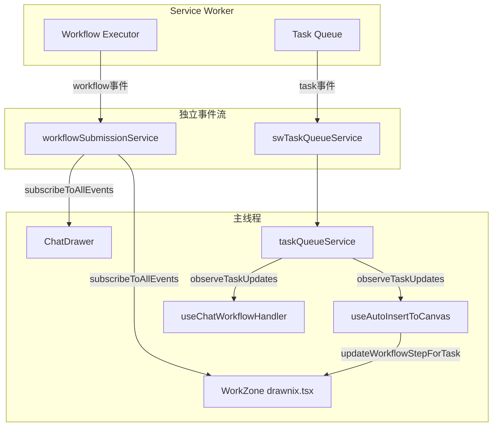
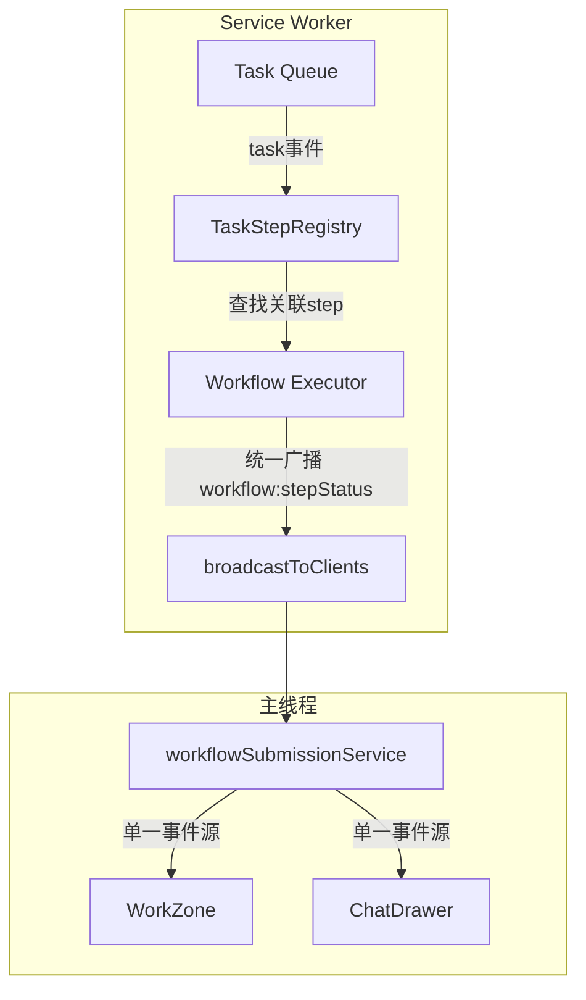

# 统一进度同步方案

## 问题分析

### 当前架构



### 根本原因

1. **两条独立的事件流**

            - `workflowSubmissionService` 接收 workflow 级别事件（step, completed, failed）
            - `swTaskQueueService` → `taskQueueService` 接收 task 级别事件

2. **WorkZone 的双重更新路径**

            - 路径1: `drawnix.tsx` 订阅 `workflowSubmissionService` 更新 workflow 状态
            - 路径2: `useAutoInsertToCanvas` 订阅 `taskQueueService` 更新有 `taskId` 的步骤
            - 路径1 更快，因为直接来自 SW 广播；路径2 需要经过 taskQueueService 同步

3. **ChatDrawer 同样有双重更新路径**

            - 路径1: `ChatDrawer.tsx` 订阅 `workflowSubmissionService`
            - 路径2: `useChatWorkflowHandler` 订阅 `taskQueueService.observeTaskUpdates()`

4. **时序不一致**

            - `workflow:stepStatus` 和 `task:completed` 是独立事件
            - workflow 可能先标记完成，但 task 还在处理中

---

## 解决方案: SW 端统一事件广播

### 核心思路

在 SW 端建立 workflow step 与 task 的关联，当 task 状态变化时，**自动触发对应 workflow step 的更新事件**。

### 方案架构



### 关键改动

#### 1. SW 端: 新增 TaskStepRegistry

位置: `apps/web/src/sw/task-queue/task-step-registry.ts`

```typescript
/**
 * 维护 task -> workflow step 的映射关系
 * 当 task 状态变化时，自动触发 workflow step 更新
 */
class TaskStepRegistry {
  // taskId -> { workflowId, stepId }
  private taskStepMap: Map<string, { workflowId: string; stepId: string }>;
  
  register(taskId: string, workflowId: string, stepId: string): void;
  unregister(taskId: string): void;
  getStepForTask(taskId: string): { workflowId: string; stepId: string } | undefined;
}
```

#### 2. SW 端: 修改 Task Queue 的事件广播

位置: `apps/web/src/sw/task-queue/queue.ts`

当 task 完成/失败时，除了广播 `task:completed/task:failed`，还要：

```typescript
// 在 handleTaskSuccess / handleTaskError 中
const stepInfo = taskStepRegistry.getStepForTask(taskId);
if (stepInfo) {
  // 广播 workflow step 状态更新
  broadcastToClients({
    type: 'WORKFLOW_STEP_STATUS',
    workflowId: stepInfo.workflowId,
    stepId: stepInfo.stepId,
    status: taskStatus === 'completed' ? 'completed' : 'failed',
    result: taskResult,
    error: taskError,
  });
}
```

#### 3. SW 端: 修改 Workflow Executor

位置: `apps/web/src/sw/task-queue/workflow-executor.ts`

当执行工具返回 `taskId` 时，注册映射关系：

```typescript
// 在工具执行完成后
if (toolResult.taskId) {
  taskStepRegistry.register(toolResult.taskId, workflowId, stepId);
}
```

#### 4. 主线程: 简化更新逻辑

- **移除** `useAutoInsertToCanvas` 中的 `updateWorkflowStepForTask` 逻辑
- **移除** `useChatWorkflowHandler` 中监听 `taskQueueService.observeTaskUpdates()` 更新步骤状态的逻辑
- 所有步骤状态更新统一由 `workflowSubmissionService` 处理

#### 5. 主线程: 统一事件处理

位置: `packages/drawnix/src/services/workflow-submission-service.ts`

已有的 `handleStepStatus` 方法可以处理所有 step 更新，无需改动。

---

## 实施步骤

### Phase 1: SW 端改动

1. 创建 `TaskStepRegistry` 类
2. 修改 `workflow-executor.ts`，在工具返回 taskId 时注册映射
3. 修改 `queue.ts`，在 task 完成/失败时触发 workflow step 事件

### Phase 2: 主线程清理

1. 移除 `useAutoInsertToCanvas` 中的 WorkZone 步骤更新逻辑（保留插入画布逻辑）
2. 移除 `useChatWorkflowHandler` 中的 taskQueueService 订阅更新步骤状态的逻辑
3. 确保 `ChatDrawer.tsx` 和 `drawnix.tsx` 的 `subscribeToAllEvents` 处理逻辑一致

### Phase 3: 验证

1. 测试图片生成：WorkZone、ChatDrawer、任务队列进度一致
2. 测试视频生成：长任务进度同步
3. 测试页面刷新后的状态恢复
4. 测试多任务并发

---

## 关键文件

| 文件 | 改动类型 | 说明 |

|------|----------|------|

| [`apps/web/src/sw/task-queue/task-step-registry.ts`](apps/web/src/sw/task-queue/task-step-registry.ts) | 新增 | TaskStepRegistry 类 |

| [`apps/web/src/sw/task-queue/queue.ts`](apps/web/src/sw/task-queue/queue.ts) | 修改 | 添加 step 事件触发 |

| [`apps/web/src/sw/task-queue/workflow-executor.ts`](apps/web/src/sw/task-queue/workflow-executor.ts) | 修改 | 注册 task-step 映射 |

| [`packages/drawnix/src/hooks/useAutoInsertToCanvas.ts`](packages/drawnix/src/hooks/useAutoInsertToCanvas.ts) | 修改 | 移除 WorkZone 步骤更新 |

| [`packages/drawnix/src/hooks/useChatWorkflowHandler.ts`](packages/drawnix/src/hooks/useChatWorkflowHandler.ts) | 修改 | 移除 task 订阅更新步骤 |

---

## 备选方案

如果 SW 端改动风险较大，可以采用纯主线程方案：

**方案 B: 主线程统一状态管理**

创建 `UnifiedProgressService`，在主线程合并 workflow 事件和 task 事件后再分发：

```typescript
class UnifiedProgressService {
  // 接收 workflowSubmissionService 事件
  // 接收 taskQueueService 事件
  // 合并后统一广播
  subscribeToUnifiedEvents(callback): Subscription
}
```

这个方案改动范围小，但无法解决事件时序问题（task 事件仍可能比 workflow 事件慢）。

---

## 推荐

采用 **SW 端统一事件广播** 方案，因为：

1. 从根源解决时序问题
2. 减少主线程复杂度
3. 数据流更清晰（单一事件源）
4. 便于后续扩展