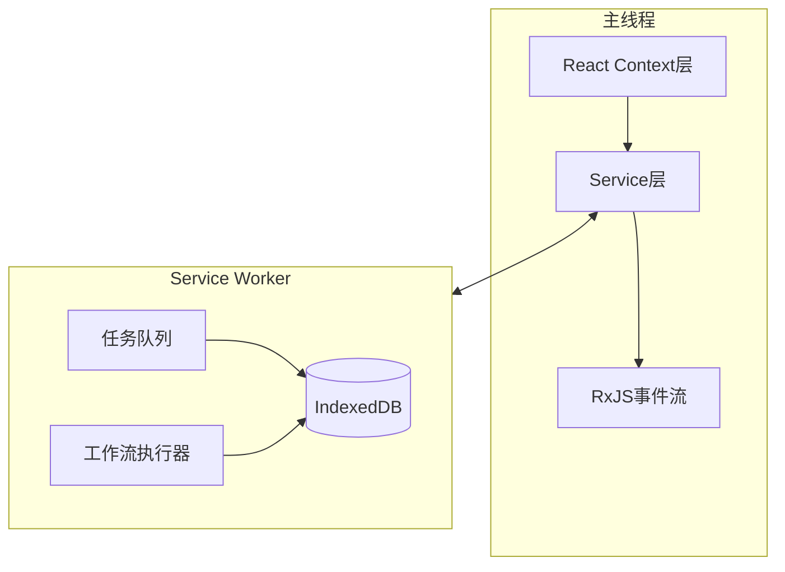
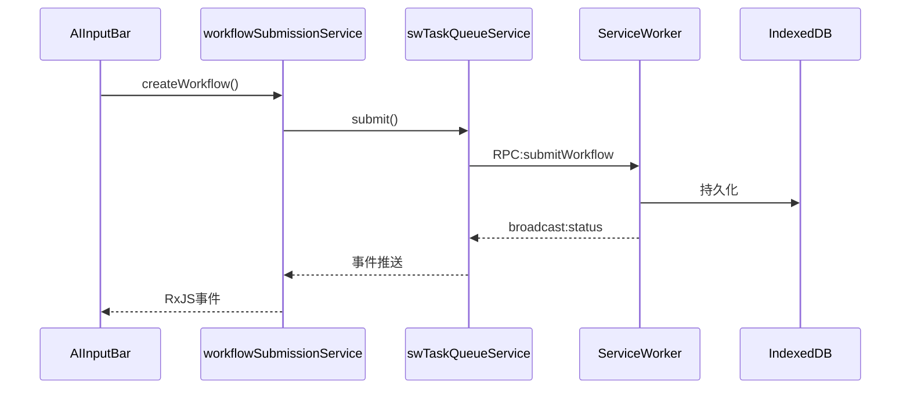
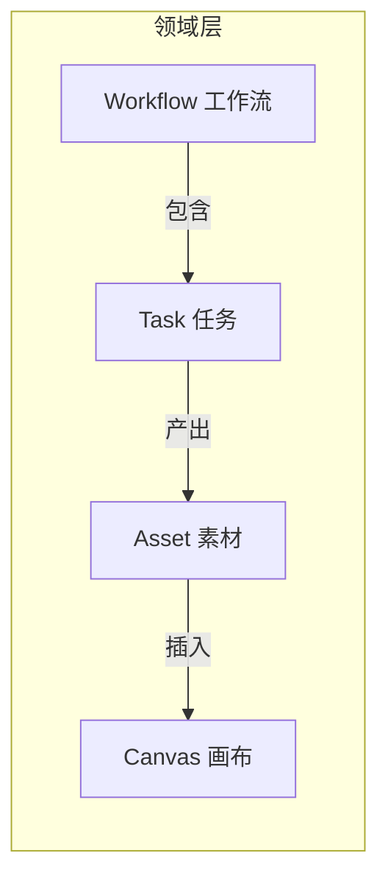

# 领域驱动架构重构方案

## 一、当前架构问题分析

### 1.1 状态管理现状

当前项目采用混合模式：React Context + RxJS + IndexedDB + Service Worker，导致以下复杂性：




### 1.2 核心痛点


| 问题         | 现状                                                                                                                           | 影响                       |
| ---------- | ---------------------------------------------------------------------------------------------------------------------------- | ------------------------ |
| **类型重复定义** | `Task` 在 [task.types.ts](packages/drawnix/src/types/task.types.ts) 和 [sw/types.ts](apps/web/src/sw/task-queue/types.ts) 各有一份 | 需要转换逻辑，容易遗漏字段            |
| **双服务同步**  | `taskQueueService` 和 `swTaskQueueService` 独立维护状态                                                                             | 需要手动 `syncTasksFromSW()` |
| **状态分散**   | 10+ Context, 8+ RxJS Subject, 10+ IndexedDB store                                                                            | 状态追踪困难                   |
| **缺乏领域模型** | 任务、工作流、素材没有统一抽象                                                                                                              | 业务逻辑分散在各服务中              |


### 1.3 关键代码路径（状态流转示例）

任务创建的状态流转涉及多个层：




---

## 二、DDD 适用性评估

### 2.1 项目特点

- **复杂业务逻辑**：AI 生成、工作流编排、素材管理、画布操作
- **跨进程通信**：主线程与 Service Worker 需要状态同步
- **多数据源**：IndexedDB、Cache Storage、内存状态
- **事件驱动**：大量异步状态变更

### 2.2 结论

**DDD 思想适合本项目**，但需要务实地应用：

- 不需要完整的 DDD 战术模式（如仓储、聚合根边界等）
- 重点在于**提取统一的领域模型**和**领域服务**
- 保持与现有 SW 架构的兼容性

---

## 三、领域层设计

### 3.1 核心领域概念




### 3.2 目录结构

```
packages/drawnix/src/
├── domain/                          # 新增领域层
│   ├── task/
│   │   ├── task.model.ts            # 统一任务模型
│   │   ├── task.events.ts           # 任务领域事件
│   │   ├── task.service.ts          # 任务领域服务
│   │   └── task.repository.ts       # 任务仓储（封装 SW 通信）
│   │
│   ├── workflow/
│   │   ├── workflow.model.ts        # 工作流模型
│   │   ├── workflow.events.ts       # 工作流事件
│   │   ├── workflow.service.ts      # 工作流服务
│   │   └── workflow.repository.ts   # 工作流仓储
│   │
│   ├── asset/
│   │   ├── asset.model.ts           # 素材模型
│   │   └── asset.service.ts         # 素材服务
│   │
│   └── shared/
│       ├── event-bus.ts             # 统一事件总线
│       └── domain-error.ts          # 领域错误
│
├── services/                        # 现有服务层（逐步迁移）
├── contexts/                        # React Context（调用领域服务）
└── hooks/                           # Hooks（使用 Context）
```

### 3.3 统一任务模型

```typescript
// domain/task/task.model.ts
export interface Task {
  id: string;
  type: TaskType;
  status: TaskStatus;
  params: GenerationParams;
  timestamps: {
    created: number;
    updated: number;
    started?: number;
    completed?: number;
  };
  result?: TaskResult;
  error?: TaskError;
  execution?: {
    phase?: TaskExecutionPhase;
    progress?: number;
    remoteId?: string;
  };
}

// 消除 Task vs SWTask 的区别，统一使用一个模型
```

### 3.4 领域事件

```typescript
// domain/shared/event-bus.ts
export type DomainEvent =
  | { type: 'task:created'; task: Task }
  | { type: 'task:updated'; task: Task; changes: Partial<Task> }
  | { type: 'task:completed'; task: Task }
  | { type: 'task:failed'; task: Task; error: TaskError }
  | { type: 'workflow:started'; workflow: Workflow }
  | { type: 'workflow:stepCompleted'; workflow: Workflow; step: WorkflowStep }
  | { type: 'workflow:completed'; workflow: Workflow }
  | { type: 'asset:imported'; asset: Asset };

// 统一事件总线，替代分散的 RxJS Subject
```

### 3.5 任务仓储（封装 SW 通信）

```typescript
// domain/task/task.repository.ts
export class TaskRepository {
  // 内部处理主线程与 SW 的同步
  // 对外提供统一的 CRUD 接口
  
  async create(params: CreateTaskParams): Promise<Task>;
  async getById(id: string): Promise<Task | null>;
  async getAll(filter?: TaskFilter): Promise<Task[]>;
  async update(id: string, changes: Partial<Task>): Promise<Task>;
  async delete(id: string): Promise<void>;
  
  // 订阅任务变更
  observe(filter?: TaskFilter): Observable<Task[]>;
}
```

---

## 四、分阶段实施计划

### 阶段一：统一类型定义（低风险，高收益）

**目标**：消除 `Task` 和 `SWTask` 的重复定义

**步骤**：

1. 在 `@aitu/shared-types` 或 `packages/drawnix/src/domain/task/task.model.ts` 定义统一 Task 类型
2. SW 端直接导入统一类型（通过 esbuild bundle）
3. 删除 `apps/web/src/sw/task-queue/types.ts` 中的重复定义
4. 删除 `convertTaskToSWTask()` 和 `convertSWTaskToTask()` 转换函数

**涉及文件**：

- [packages/drawnix/src/types/task.types.ts](packages/drawnix/src/types/task.types.ts)
- [apps/web/src/sw/task-queue/types.ts](apps/web/src/sw/task-queue/types.ts)
- [packages/drawnix/src/services/sw-task-queue-service.ts](packages/drawnix/src/services/sw-task-queue-service.ts)

---

### 阶段二：创建领域层基础结构

**目标**：建立 `domain/` 目录和统一事件总线

**步骤**：

1. 创建 `domain/shared/event-bus.ts`：统一事件总线
2. 创建 `domain/task/task.model.ts`：任务领域模型
3. 创建 `domain/task/task.events.ts`：任务领域事件
4. 创建 `domain/workflow/workflow.model.ts`：工作流模型

---

### 阶段三：重构任务服务

**目标**：合并 `taskQueueService` 和 `swTaskQueueService`

**步骤**：

1. 创建 `domain/task/task.repository.ts`：封装 SW 通信
2. 创建 `domain/task/task.service.ts`：业务逻辑
3. 修改 `useTaskQueue` hook：调用 `taskService` 而非直接调用两个 service
4. 逐步废弃 `taskQueueService` 和 `swTaskQueueService`

**新的调用链**：

```
useTaskQueue → TaskService → TaskRepository → SW 通信
                    ↓
              EventBus (统一事件)
```

---

### 阶段四：重构工作流服务

**目标**：统一 `workflowSubmissionService` 和 `WorkflowContext`

**步骤**：

1. 创建 `domain/workflow/workflow.service.ts`
2. 修改 `WorkflowContext`：调用 `workflowService`
3. 废弃 `workflowSubmissionService.events$`，改用统一 `EventBus`

---

### 阶段五：重构素材服务

**目标**：统一素材管理

**步骤**：

1. 创建 `domain/asset/asset.service.ts`
2. 合并 `assetStorageService`、任务队列已完成任务、`unifiedCacheService` 的数据
3. 修改 `AssetContext`：调用 `assetService`

---

## 五、收益预期


| 指标              | 当前       | 重构后             |
| --------------- | -------- | --------------- |
| 任务相关服务数量        | 3 个      | 1 个 TaskService |
| RxJS Subject 数量 | 8+ 个     | 1 个统一 EventBus  |
| 类型定义重复          | 2 套      | 1 套统一模型         |
| 状态同步复杂度         | 手动 sync  | 自动透明同步          |
| 新功能开发成本         | 需要了解多个服务 | 只需调用领域服务        |


---

## 六、风险与缓解


| 风险        | 缓解措施                       |
| --------- | -------------------------- |
| 重构范围过大    | 分阶段进行，每阶段可独立上线             |
| 与 SW 架构冲突 | Repository 层封装 SW 通信，对上层透明 |
| 向后兼容      | 旧 API 标记 deprecated，提供迁移期  |
| 测试覆盖      | 优先为领域服务编写单元测试              |


---

## 七、是否推荐执行

**推荐执行**，但建议：

1. 从**阶段一**（统一类型定义）开始，这是低风险高收益的改进
2. 每完成一个阶段后评估效果，再决定是否继续
3. 不必追求完整的 DDD 实现，务实地解决当前痛点即可

