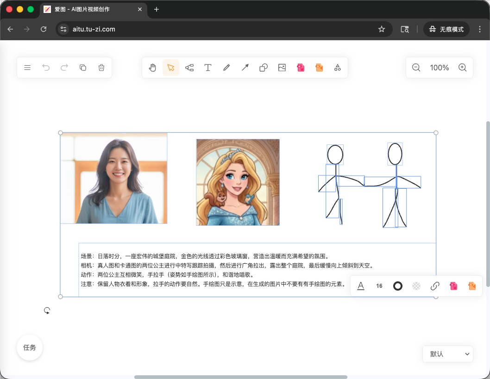
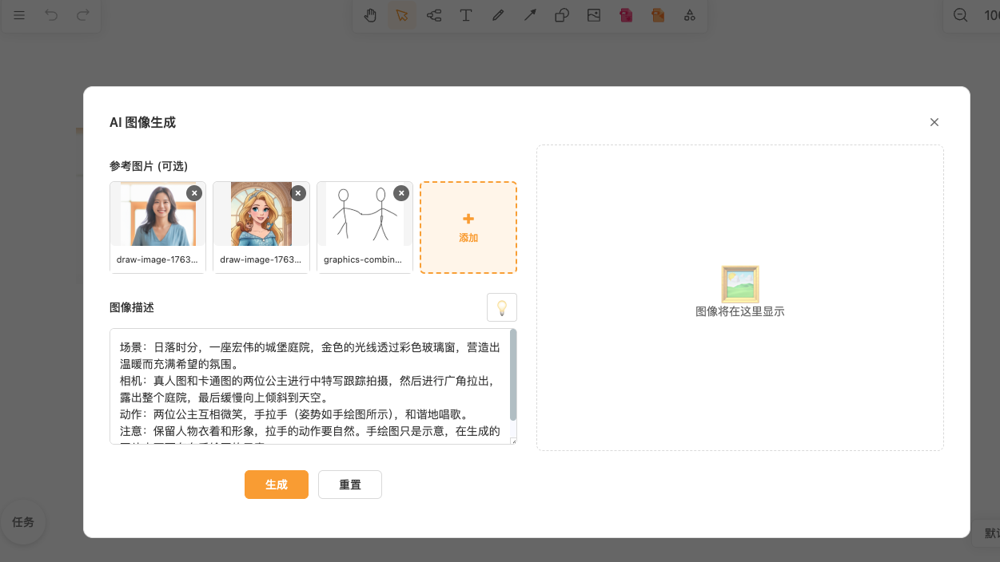
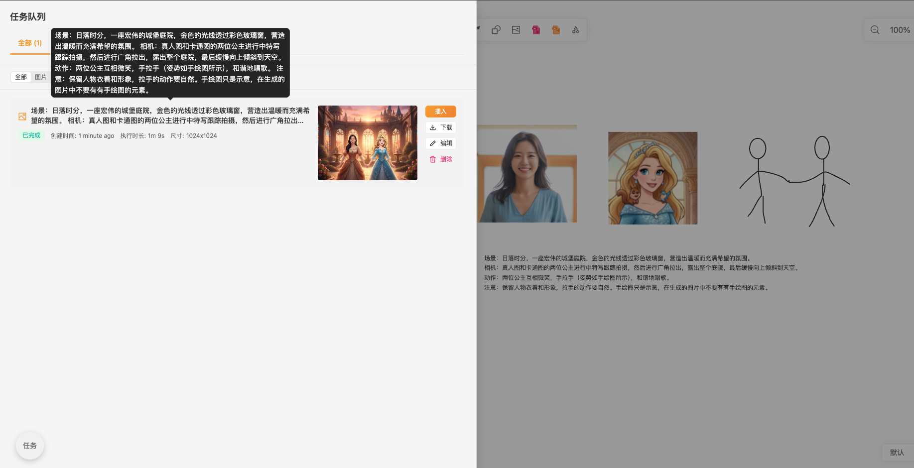
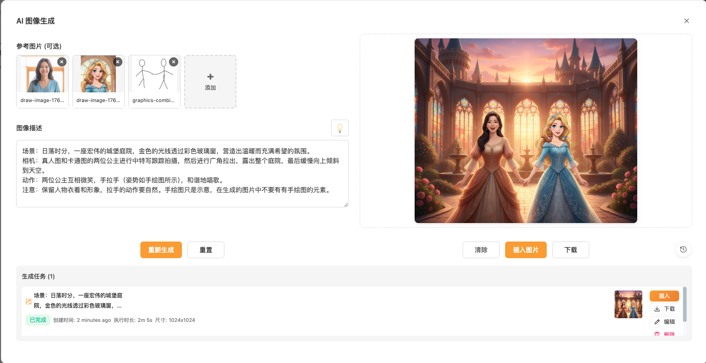

<div align="center">
  <h1>
    爱图 (Aitu)
  </h1>
  <h3>
    AI图片视频创作（SaaS） + 一体化白板
  </h3>
  <p>
    思维导图 · 流程图 · 自由画 · AI生图 · AI生视频
  </p>
  <p>
    <a href="https://github.com/ljquan/aitu/releases"></a>
    <a href="https://github.com/ljquan/aitu/blob/master/LICENSE"></a>
    <a href="https://aitu.tu-zi.com"></a>
  </p>
</div>

[*English README*](https://github.com/ljquan/aitu/blob/develop/README_en.md)

## 特性

### AI 创作能力 🔥
- **AI 图像生成** - 支持多种图像生成模型
  - gemini-2.5-flash-image (nano-banana) - 快速生图
  - gemini-3-pro-image-preview (nano-banana-2) - 高质量生图，支持 HD/2K/4K 分辨率
  - 支持文本转图像、图像参考生成、批量生成
- **AI 视频生成** - 支持多种视频生成模型
  - Veo3 / Veo3 Pro - 高质量视频生成
  - Veo3.1 / Veo3.1 Pro - 支持首尾帧控制，多图参考
  - Sora-2 / Sora-2 Pro - OpenAI 视频模型
  - 支持图生视频、进度追踪、任务管理
- **模型自由切换** - 在生成对话框中即时切换不同的 AI 模型
- **任务队列管理** - 异步任务处理，支持批量生成、任务重试、历史记录、媒体缓存

### 白板与可视化
- **思维导图** - 快速构建思维导图，支持多种布局和样式
- **流程图** - 专业的流程图绘制，支持 Mermaid 语法转换
- **自由画笔** - 手绘创作，支持多种画笔工具
- **图片插入** - 支持插入和编辑图片元素
- **Markdown 转思维导图** - 文本快速转换为可视化结构

### 编辑与交互
- **丰富的编辑功能** - 撤销、重做、复制、粘贴、多选等
- **无限画布** - 自由缩放、滚动、移动
- **自动保存** - 本地浏览器自动保存，数据不丢失
- **多格式导出** - 支持 PNG、JSON(`.drawnix`) 等格式导出

### 体验与生态
- **完全免费 + 开源** - MIT 许可证，可商用
- **插件化架构** - 灵活扩展，支持自定义插件开发
- **主题模式** - 支持亮色/暗色主题切换
- **移动端适配** - 完美支持移动设备使用

## 产品展示

<div align="center">
  <figure>
    <a href="./apps/web/public/product_showcase/aitu-01.png" target="_blank" rel="noopener">
      
    </a>
    <figcaption>
      <p align="center">
        提示词 + 图像 概括一体
      </p>
    </figcaption>
  </figure>
</div>

<div align="center">
  <figure>
    <a href="./apps/web/public/product_showcase/aitu-02.png" target="_blank" rel="noopener">
      
    </a>
    <figcaption>
      <p align="center">
        AI 图片生成 - 质的创作飞跃
      </p>
    </figcaption>
  </figure>
</div>

<div align="center">
  <figure>
    <a href="./apps/web/public/product_showcase/aitu-03.png" target="_blank" rel="noopener">
      
    </a>
    <figcaption>
      <p align="center">
        任务处理 - 批量生成
      </p>
    </figcaption>
  </figure>
</div>

<div align="center">
  <figure>
    <a href="./apps/web/public/product_showcase/aitu-04.png" target="_blank" rel="noopener">
      
    </a>
    <figcaption>
      <p align="center">
        效果展示
      </p>
    </figcaption>
  </figure>
</div>

<div align="center">
  <figure>
    <a href="./apps/web/public/product_showcase/case-2.png" target="_blank" rel="noopener">
      
    </a>
    <figcaption>
      <p align="center">
        AI 视频生成 - 多模型选择，图生视频
      </p>
    </figcaption>
  </figure>
</div>

[*English README*](./README_en.md)


## 特性

### AI 创作能力
- **AI 图像生成** - 支持多种图像生成模型（Gemini 2.5/3.0 系列），文本转图像、图像参考生成 🔥🔥🔥
- **AI 视频生成** - 支持视频生成模型，将静态图像转化为动态视频 🔥🔥🔥
- **模型自由切换** - 在生成对话框中即时切换不同的 AI 模型
- **任务队列管理** - 异步任务处理，支持批量生成、任务重试、历史记录

### 白板与可视化
- **思维导图** - 快速构建思维导图，支持多种布局和样式
- **流程图** - 专业的流程图绘制，支持 Mermaid 语法转换
- **自由画笔** - 手绘创作，支持多种画笔工具
- **图片插入** - 支持插入和编辑图片元素
- **Markdown 转思维导图** - 文本快速转换为可视化结构

### 编辑与交互
- **丰富的编辑功能** - 撤销、重做、复制、粘贴、多选等
- **无限画布** - 自由缩放、滚动、移动
- **自动保存** - 本地浏览器自动保存，数据不丢失
- **多格式导出** - 支持 PNG、JSON(`.drawnix`) 等格式导出

<div align="center">
  <figure>
    <a target="_blank" rel="noopener">
      
    </a>
    <figcaption>
      <p align="center">
        All in one 白板 - 流程图、自由画、图片等多种创作方式
      </p>
    </figcaption>
  </figure>
</div>


## 关于名称

***爱图(Aitu)***  ，源于对创作的热爱与图形表达的追求。

*爱* 代表着对创作的热情与专注，*图* 象征着视觉表达的无限可能。在这里，每一次创作都是对美好的追求，每一笔绘画都是想象力的延伸。

创意源于内心的热爱，而  ***爱图(Aitu)***  致力于成为每个创作者的得力助手。

*爱创作，图未来。*


## 与 Plait 画图框架

*爱图(Aitu)* 的定位是一个开箱即用、开源、免费的工具产品，它的底层是 *Plait* 框架，*Plait* 是开源的画图框架，代表着在知识可视化产品上的重要技术积累。


爱图 采用插件架构，虽然技术架构相对复杂，但插件架构也有其优势，比如能够支持多种 UI 框架（*Angular、React*），能够集成不同富文本框架（当前仅支持 *Slate* 框架），在开发上可以很好的实现业务的分层，开发各种细粒度的可复用插件，可以扩展更多的画板的应用场景。


## 仓储结构

```
aitu/
├── apps/
│   └── web/                         # 爱图 Web 应用
│       ├── src/                     # 应用源码
│       ├── public/                  # 静态资源
│       └── index.html               # 入口 HTML
├── packages/
│   ├── drawnix/                     # 白板应用核心库
│   │   ├── src/
│   │   │   ├── components/          # React 组件
│   │   │   │   ├── toolbar/         # 工具栏组件
│   │   │   │   ├── ttd-dialog/      # AI 生成对话框
│   │   │   │   ├── task-queue/      # 任务队列管理
│   │   │   │   └── settings-dialog/ # 设置对话框
│   │   │   ├── plugins/             # 功能插件
│   │   │   │   ├── with-freehand.ts # 自由画笔插件
│   │   │   │   ├── with-mind.ts     # 思维导图插件
│   │   │   │   └── with-draw.ts     # 绘图插件
│   │   │   ├── services/            # 业务服务
│   │   │   │   ├── generation-api-service.ts  # AI 生成 API
│   │   │   │   └── task-queue-service.ts      # 任务队列服务
│   │   │   ├── hooks/               # React Hooks
│   │   │   ├── utils/               # 工具函数
│   │   │   │   ├── gemini-api/      # Gemini API 客户端
│   │   │   │   └── settings-manager.ts # 设置管理
│   │   │   └── types/               # TypeScript 类型定义
│   ├── react-board/                 # Plait React 视图适配层
│   └── react-text/                  # 文本渲染组件
├── dist/                            # 构建产物目录
├── docs/                            # 开发文档
├── package.json                     # 项目配置
├── nx.json                          # Nx 配置
├── tsconfig.base.json               # TypeScript 基础配置
└── README.md                        # 项目说明文档
```

### 关键目录说明

- **apps/web**: Web 应用入口，包含页面路由和全局配置
- **packages/drawnix**: 核心白板库，包含所有核心功能和组件
  - `components/`: UI 组件，包括工具栏、对话框、任务队列等
  - `plugins/`: 功能插件，采用组合模式扩展编辑器能力
  - `services/`: 业务服务层，处理 API 调用和状态管理
  - `hooks/`: React Hooks，提供可复用的状态逻辑
- **packages/react-board**: Plait 框架的 React 适配层
- **packages/react-text**: 文本编辑和渲染组件

## 应用

[*https://aitu.tu-zi.com*](https://aitu.tu-zi.com) 是 *爱图* 的在线应用。

近期会高频迭代应用功能，持续优化用户体验。


## 🚀 快速开始

### 在线体验
直接访问 [aitu.tu-zi.com](https://aitu.tu-zi.com) 立即开始使用，无需安装任何软件。

### 本地开发

#### 环境要求
- Node.js >= 16.0.0
- npm >= 8.0.0

#### 安装步骤

```bash
# 克隆仓库
git clone https://github.com/ljquan/aitu.git
cd aitu

# 安装依赖
npm install

# 启动开发服务器
npm start
```

启动成功后，访问 `http://localhost:4200` 即可看到应用。

#### 可用命令

```bash
# 开发
npm start                    # 启动开发服务器
npm test                     # 运行测试
npm run build                # 构建所有包
npm run build:web            # 仅构建 web 应用

# 版本管理
npm run version:patch        # 版本号 +0.0.1
npm run version:minor        # 版本号 +0.1.0
npm run version:major        # 版本号 +1.0.0

# 发布
npm run release             # 发布补丁版本
npm run release:minor       # 发布小版本
npm run release:major       # 发布大版本
```

### 📚 开发文档

详细的开发文档位于 [`docs/`](./docs/) 目录：

- **[版本控制](./docs/VERSION_CONTROL.md)** - 版本管理和发布流程
- **[部署指南](./docs/CFPAGE-DEPLOY.md)** - Cloudflare Pages 部署
- **[PWA 配置](./docs/PWA_ICONS.md)** - PWA 图标生成指南

### 🧪 测试

```bash
# 运行所有测试
npm test

# 运行特定项目测试
nx test drawnix
nx test react-board
```


## 📖 使用说明

### 基本功能

#### 创建内容
- **思维导图**: 点击工具栏中的思维导图图标，开始创建分支节点
- **流程图**: 选择流程图工具，拖拽创建形状和连接线
- **自由绘画**: 使用画笔工具进行手绘创作
- **文本编辑**: 双击任意位置添加文本

#### 导入导出
- **导出格式**: 支持 PNG、JPG、JSON(.drawnix) 格式
- **文本转换**:
  - 支持 Markdown 文本转思维导图
  - 支持 Mermaid 语法转流程图

#### 快捷操作
- `Ctrl/Cmd + Z`: 撤销
- `Ctrl/Cmd + Y`: 重做
- `Ctrl/Cmd + C`: 复制
- `Ctrl/Cmd + V`: 粘贴
- 鼠标滚轮: 缩放画布
- 拖拽: 移动画布

### 🔧 插件开发

爱图 基于插件架构，支持自定义扩展：

```typescript
import { withFreehand, withMind, withDraw } from '@aitu/core';

// 创建带有特定插件的编辑器实例
const editor = withFreehand(
  withMind(
    withDraw(createEditor())
  )
);
```

### 🐳 Docker 部署

```bash
# 拉取镜像
docker pull ljquan/aitu:latest

# 运行容器
docker run -d -p 8080:80 ljquan/aitu:latest
```

访问 `http://localhost:8080` 即可使用。

## 🏗️ 技术架构

### 技术栈
- **前端框架**: React 18.3+ with TypeScript
- **构建工具**: Vite + Nx (Monorepo)
- **UI 组件库**: TDesign React
- **绘图引擎**: Plait Framework
- **富文本编辑**: Slate.js
- **状态管理**: React Context + Hooks
- **样式方案**: Sass + CSS Module

### 核心模块

```
packages/
├── drawnix/           # 核心白板应用
│   ├── src/
│   │   ├── components/    # React 组件
│   │   ├── plugins/       # 功能插件
│   │   ├── transforms/    # 数据转换
│   │   └── utils/         # 工具函数
├── react-board/       # Plait React 适配层
├── react-text/        # 文本渲染组件
```

### 插件系统

采用组合式插件架构，每个插件负责特定功能：

- **withFreehand**: 自由绘画功能
- **withMind**: 思维导图功能
- **withDraw**: 基础图形绘制
- **withHotkey**: 快捷键支持
- **withTextLink**: 文本链接功能

## 📦 依赖说明

### 核心依赖
- [plait](https://github.com/worktile/plait) - 开源画图框架，提供底层绘图能力
- [slate](https://github.com/ianstormtaylor/slate) - 富文本编辑器框架，处理文本编辑逻辑
- [floating-ui](https://github.com/floating-ui/floating-ui) - 浮层定位库，用于工具栏和弹窗定位
- [tdesign-react](https://tdesign.tencent.com/react) - 企业级 UI 组件库
- [localforage](https://github.com/localForage/localForage) - 浏览器存储方案，支持自动保存

### 开发依赖
- **Nx**: Monorepo 管理工具
- **Vite**: 现代构建工具，提供快速的开发体验
- **TypeScript**: 类型安全的 JavaScript 超集
- **ESLint + Prettier**: 代码质量和格式化工具


## 🤝 贡献指南

我们欢迎并感谢任何形式的贡献！

### 贡献方式

#### 🐛 报告问题
- 使用 [GitHub Issues](https://github.com/ljquan/aitu/issues) 报告 Bug
- 请提供详细的重现步骤和环境信息
- 附上截图或录屏会更有帮助

#### 💡 功能建议
- 在 Issues 中标记为 `enhancement`
- 描述使用场景和预期效果
- 讨论技术实现方案

#### 🔧 代码贡献

1. **Fork 项目**
   ```bash
   git clone https://github.com/your-username/aitu.git
   ```

2. **创建功能分支**
   ```bash
   git checkout -b feature/your-feature-name
   ```

3. **本地开发**
   ```bash
   npm install
   npm start
   ```

4. **代码规范**
   - 遵循现有代码风格
   - 运行 `nx lint` 检查代码质量
   - 运行 `nx test` 确保测试通过
   - 添加必要的测试用例

5. **提交更改**
   ```bash
   git add .
   git commit -m "feat: add your feature description"
   ```

6. **推送并创建 PR**
   ```bash
   git push origin feature/your-feature-name
   ```

#### 📝 文档贡献
- 改进 README 文档
- 完善代码注释
- 编写使用教程

### 开发约定

- **提交信息格式**: 遵循 [Conventional Commits](https://conventionalcommits.org/)
- **分支命名**: `feature/功能名称`、`fix/问题描述`、`docs/文档更新`
- **代码风格**: 使用 ESLint + Prettier 保持一致性

## 🚨 问题排查

### 常见问题

#### 安装问题
```bash
# 清除缓存重新安装
npm cache clean --force
rm -rf node_modules package-lock.json
npm install
```

#### 开发服务器启动失败
```bash
# 检查端口占用
lsof -i :4200

# 指定其他端口
npm start -- --port 3000
```

#### 构建失败
```bash
# 检查 TypeScript 类型错误
nx typecheck drawnix

# 检查代码风格
nx lint drawnix
```

#### 性能问题
- 大型画板文件可能导致渲染缓慢
- 建议分割为多个小文件
- 关闭不必要的插件功能

### 获取帮助
- 📖 查看 [文档](./docs/)
- 💬 提交 [Issue](https://github.com/ljquan/aitu/issues)
- 🗣️ 参与 [Discussions](https://github.com/ljquan/aitu/discussions)

## 🗺️ 路线图

### 已完成 ✅
- ✅ 基础白板功能
- ✅ 思维导图和流程图
- ✅ 自由绘画和图片插入
- ✅ Markdown/Mermaid 转换
- ✅ 移动端适配
- ✅ AI 图像生成（多模型支持）
- ✅ AI 视频生成（Veo3/Sora-2）
- ✅ 任务队列与批量生成
- ✅ 媒体缓存功能

### 开发中 🚧
- 🚧 协作功能 (多人实时编辑)
- 🚧 更多导出格式 (PDF, SVG)
- 🚧 模板系统
- 🚧 插件市场

### 计划中 📅
- 📅 云端同步存储
- 📅 版本历史管理
- 📅 API 开放平台
- 📅 桌面客户端

发布计划请关注 [Releases](https://github.com/ljquan/aitu/releases) 页面。

## 💬 交流与反馈

欢迎加入社区交流，分享使用心得和创作作品！

<div align="center">
  
  <p>扫码加入交流群</p>
</div>

- 💬 GitHub Discussions: [参与讨论](https://github.com/ljquan/aitu/discussions)
- 🐛 问题反馈: [提交 Issue](https://github.com/ljquan/aitu/issues)


## License

[MIT License](https://github.com/ljquan/aitu/blob/master/LICENSE)  
