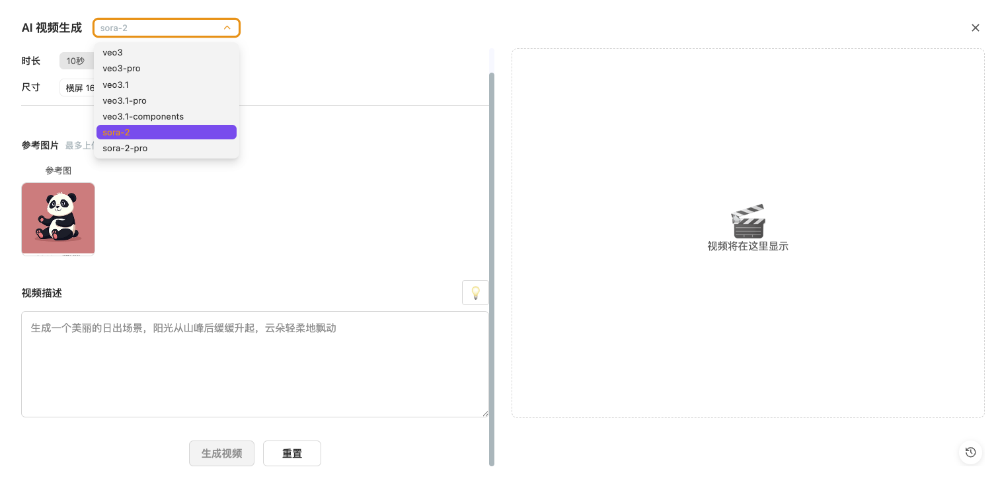
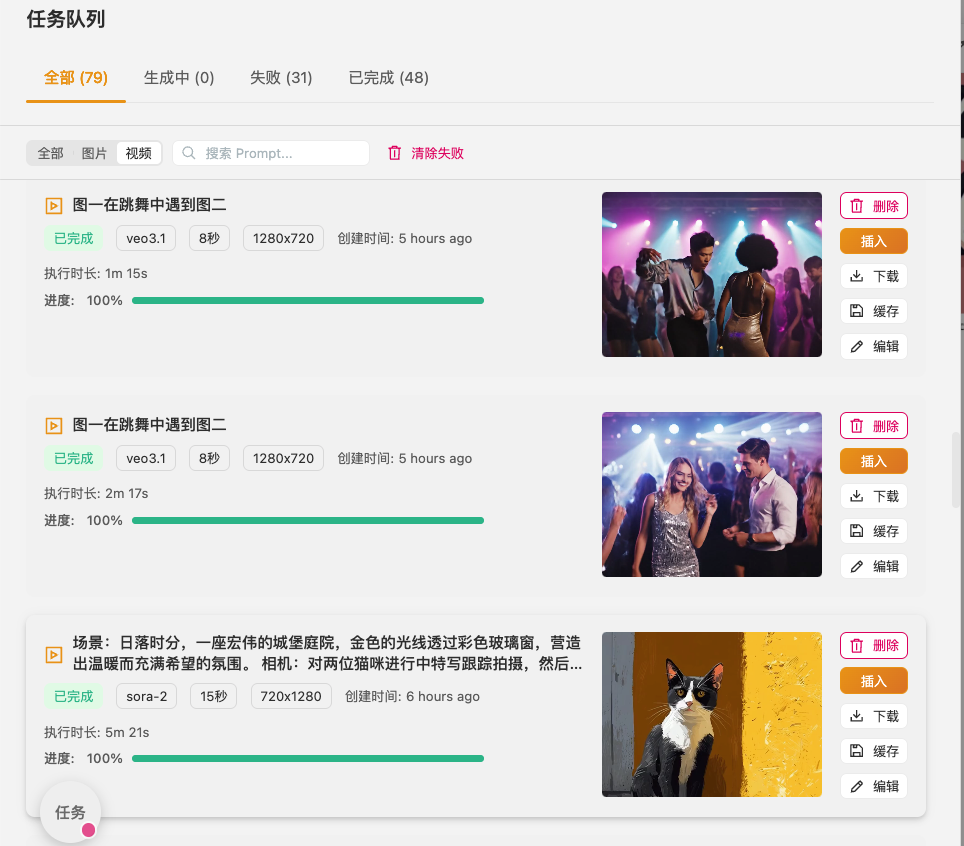

<div align="center">
  <h1>
    Aitu
  </h1>
  <h3>
    AI Image & Video Creation (SaaS) + All-in-One Whiteboard
  </h3>
  <p>
    Mind Maps · Flowcharts · Freehand · AI Image Generation · AI Video Generation
  </p>
  <p>
    <a href="https://github.com/ljquan/aitu/releases"></a>
    <a href="https://github.com/ljquan/aitu/blob/master/LICENSE"></a>
    <a href="https://aitu.tu-zi.com"></a>
  </p>
</div>

[*中文*](https://github.com/ljquan/aitu/blob/develop/README.md)

## Features

### AI Creation Capabilities 🔥
- **AI Image Generation** - Multiple image generation models
  - gemini-2.5-flash-image (nano-banana) - Fast image generation
  - gemini-3-pro-image-preview (nano-banana-2) - High quality, supports HD/2K/4K resolution
  - Text-to-image, image reference generation, batch generation
- **AI Video Generation** - Multiple video generation models
  - Veo3 / Veo3 Pro - High quality video generation
  - Veo3.1 / Veo3.1 Pro - First/last frame control, multi-image reference
  - Sora-2 / Sora-2 Pro - OpenAI video model
  - Image-to-video, progress tracking, task management
- **Model Switching** - Instantly switch between AI models in generation dialogs
- **Task Queue Management** - Async task processing, batch generation, retry, history, media caching

### Whiteboard & Visualization
- **Mind Maps** - Quick mind map creation with various layouts and styles
- **Flowcharts** - Professional flowchart drawing with Mermaid syntax support
- **Freehand Drawing** - Hand-drawn creations with multiple brush tools
- **Image Support** - Insert and edit image elements
- **Markdown to Mind Map** - Convert text to visual structures

### Editing & Interaction
- **Rich Editing Features** - Undo, redo, copy, paste, multi-select, etc.
- **Infinite Canvas** - Free zoom, scroll, pan
- **Auto-save** - Local browser auto-save, no data loss
- **Multi-format Export** - Supports PNG, JSON(`.drawnix`) formats

### Experience & Ecosystem
- **Free & Open Source** - MIT license, commercial use allowed
- **Plugin Architecture** - Flexible extensions with custom plugin development
- **Theme Support** - Light/dark theme switching
- **Mobile-friendly** - Perfect mobile device support

## Product Showcase

<div align="center">
  <figure>
    <a target="_blank" rel="noopener">
      
    </a>
    <figcaption>
      <p align="center">
        Prompt + Image Integration
      </p>
    </figcaption>
  </figure>
</div>

<div align="center">
  <figure>
    <a target="_blank" rel="noopener">
      
    </a>
    <figcaption>
      <p align="center">
        AI Image Generation - Creative Leap
      </p>
    </figcaption>
  </figure>
</div>

<div align="center">
  <figure>
    <a target="_blank" rel="noopener">
      
    </a>
    <figcaption>
      <p align="center">
        Task Processing - Batch Generation
      </p>
    </figcaption>
  </figure>
</div>

<div align="center">
  <figure>
    <a target="_blank" rel="noopener">
      
    </a>
    <figcaption>
      <p align="center">
        Results Display
      </p>
    </figcaption>
  </figure>
</div>

<div align="center">
  <figure>
    <a target="_blank" rel="noopener">
      
    </a>
    <figcaption>
      <p align="center">
        AI Video Generation - Multi-model, Image-to-Video
      </p>
    </figcaption>
  </figure>
</div>

<div align="center">
  <figure>
    <a target="_blank" rel="noopener">
      
    </a>
    <figcaption>
      <p align="center">
        Task Queue - Progress Tracking, Batch Management, Media Cache
      </p>
    </figcaption>
  </figure>
</div>

<div align="center">
  <figure>
    <a target="_blank" rel="noopener">
      
    </a>
    <figcaption>
      <p align="center">
        All-in-One Whiteboard - Flowcharts, Freehand, Images and More
      </p>
    </figcaption>
  </figure>
</div>


## About the Name

***Aitu*** is born from the love of creation and the pursuit of visual expression.

*Ai* represents passion and dedication to creation, while *tu* symbolizes the infinite possibilities of visual expression. Here, each creation is a pursuit of beauty, every stroke an extension of imagination.

Creativity stems from inner love, and ***Aitu*** is committed to being a powerful assistant for every creator.

*Love Creation, Visualize the Future.*

## About Plait Drawing Framework

*Aitu* is positioned as an out-of-the-box, *open-source*, and free tool product. It is built on top of the *Plait* framework, which is an *open-source* drawing framework representing significant technical accumulation in knowledge visualization products.


*Aitu* uses a *plugin architecture*, which is technically more complex than traditional *open-source* tools. However, this *plugin architecture* has its advantages: it supports multiple *UI frameworks* (*Angular*, *React*), integrates with different *rich text frameworks* (currently only supporting *Slate* framework), enables better business layer separation in development, allows development of various fine-grained reusable plugins, and can expand to more whiteboard application scenarios.

## Repository Structure

```
aitu/
├── apps/
│   └── web/                         # Aitu Web Application
│       ├── src/                     # Source code
│       ├── public/                  # Static assets
│       └── index.html               # Entry HTML
├── packages/
│   ├── drawnix/                     # Whiteboard core library
│   │   ├── src/
│   │   │   ├── components/          # React components
│   │   │   │   ├── toolbar/         # Toolbar components
│   │   │   │   ├── ttd-dialog/      # AI generation dialogs
│   │   │   │   ├── task-queue/      # Task queue management
│   │   │   │   └── settings-dialog/ # Settings dialog
│   │   │   ├── plugins/             # Feature plugins
│   │   │   │   ├── with-freehand.ts # Freehand drawing plugin
│   │   │   │   ├── with-mind.ts     # Mind map plugin
│   │   │   │   └── with-draw.ts     # Drawing plugin
│   │   │   ├── services/            # Business services
│   │   │   │   ├── generation-api-service.ts  # AI generation API
│   │   │   │   └── task-queue-service.ts      # Task queue service
│   │   │   ├── hooks/               # React Hooks
│   │   │   ├── utils/               # Utility functions
│   │   │   │   ├── gemini-api/      # Gemini API client
│   │   │   │   └── settings-manager.ts # Settings management
│   │   │   └── types/               # TypeScript type definitions
│   ├── react-board/                 # Plait React view adapter
│   └── react-text/                  # Text rendering components
├── dist/                            # Build artifacts
├── docs/                            # Development docs
├── package.json                     # Project config
├── nx.json                          # Nx config
├── tsconfig.base.json               # TypeScript base config
└── README.md                        # Project readme
```

### Key Directory Description

- **apps/web**: Web application entry, contains page routing and global config
- **packages/drawnix**: Core whiteboard library with all core features and components
  - `components/`: UI components including toolbars, dialogs, task queue
  - `plugins/`: Feature plugins using composition pattern
  - `services/`: Business service layer for API calls and state management
  - `hooks/`: React Hooks providing reusable state logic
- **packages/react-board**: Plait framework React adapter layer
- **packages/react-text**: Text editing and rendering components

## Try It Out

[*https://aitu.tu-zi.com*](https://aitu.tu-zi.com) is the online application of *Aitu*.

We will be iterating frequently on application features to continuously optimize user experience.


## 🚀 Quick Start

### Online Experience
Visit [aitu.tu-zi.com](https://aitu.tu-zi.com) directly to start using it immediately, no installation required.

### Local Development

#### Requirements
- Node.js >= 16.0.0
- npm >= 8.0.0

#### Installation Steps

```bash
# Clone the repository
git clone https://github.com/ljquan/aitu.git
cd aitu

# Install dependencies
npm install

# Start development server
npm start
```

After successful startup, visit `http://localhost:4200` to see the application.

#### Available Commands

```bash
# Development
npm start                    # Start development server
npm test                     # Run tests
npm run build                # Build all packages
npm run build:web            # Build web app only

# Version Management
npm run version:patch        # Version +0.0.1
npm run version:minor        # Version +0.1.0
npm run version:major        # Version +1.0.0

# Release
npm run release             # Release patch version
npm run release:minor       # Release minor version
npm run release:major       # Release major version
```

### 📚 Documentation

Detailed development documentation is located in the [`docs/`](./docs/) directory:

- **[Version Control](./docs/VERSION_CONTROL.md)** - Version management and release process
- **[Deployment Guide](./docs/CFPAGE-DEPLOY.md)** - Cloudflare Pages deployment
- **[PWA Configuration](./docs/PWA_ICONS.md)** - PWA icon generation guide

### 🧪 Testing

```bash
# Run all tests
npm test

# Run specific project tests
nx test drawnix
nx test react-board
```

## 📖 Usage Guide

### Basic Features

#### Creating Content
- **Mind Maps**: Click the mind map icon in the toolbar to start creating branch nodes
- **Flowcharts**: Select flowchart tools to drag and create shapes and connectors
- **Freehand Drawing**: Use brush tools for hand-drawn creations
- **Text Editing**: Double-click anywhere to add text

#### Import/Export
- **Export Formats**: Supports PNG, JPG, JSON(.drawnix) formats
- **Text Conversion**:
  - Support Markdown text to mind map conversion
  - Support Mermaid syntax to flowchart conversion

#### Shortcuts
- `Ctrl/Cmd + Z`: Undo
- `Ctrl/Cmd + Y`: Redo
- `Ctrl/Cmd + C`: Copy
- `Ctrl/Cmd + V`: Paste
- Mouse wheel: Zoom canvas
- Drag: Move canvas

### 🔧 Plugin Development

Aitu is built on a plugin architecture and supports custom extensions:

```typescript
import { withFreehand, withMind, withDraw } from '@aitu/core';

// Create editor instance with specific plugins
const editor = withFreehand(
  withMind(
    withDraw(createEditor())
  )
);
```

### 🐳 Docker Deployment

```bash
# Pull image
docker pull ljquan/aitu:latest

# Run container
docker run -d -p 8080:80 ljquan/aitu:latest
```

Visit `http://localhost:8080` to use.

## 🏗️ Technical Architecture

### Tech Stack
- **Frontend Framework**: React 18.3+ with TypeScript
- **Build Tools**: Vite + Nx (Monorepo)
- **UI Component Library**: TDesign React
- **Drawing Engine**: Plait Framework
- **Rich Text Editor**: Slate.js
- **State Management**: React Context + Hooks
- **Styling**: Sass + CSS Module

### Core Modules

```
packages/
├── drawnix/           # Core whiteboard application
│   ├── src/
│   │   ├── components/    # React components
│   │   ├── plugins/       # Feature plugins
│   │   ├── transforms/    # Data transformations
│   │   └── utils/         # Utility functions
├── react-board/       # Plait React adapter layer
├── react-text/        # Text rendering components
```

### Plugin System

Uses a composable plugin architecture where each plugin handles specific functionality:

- **withFreehand**: Freehand drawing capabilities
- **withMind**: Mind mapping functionality
- **withDraw**: Basic shape drawing
- **withHotkey**: Keyboard shortcut support
- **withTextLink**: Text link functionality

## 📦 Dependencies

### Core Dependencies
- [plait](https://github.com/worktile/plait) - Open source drawing framework providing underlying drawing capabilities
- [slate](https://github.com/ianstormtaylor/slate) - Rich text editor framework handling text editing logic
- [floating-ui](https://github.com/floating-ui/floating-ui) - Floating layer positioning library for toolbars and popups
- [tdesign-react](https://tdesign.tencent.com/react) - Enterprise-class UI component library
- [localforage](https://github.com/localForage/localForage) - Browser storage solution supporting auto-save

### Development Dependencies
- **Nx**: Monorepo management tool
- **Vite**: Modern build tool providing fast development experience
- **TypeScript**: Type-safe JavaScript superset
- **ESLint + Prettier**: Code quality and formatting tools


## 🤝 Contributing Guide

We welcome and appreciate any form of contribution!

### Ways to Contribute

#### 🐛 Report Issues
- Use [GitHub Issues](https://github.com/ljquan/aitu/issues) to report bugs
- Please provide detailed reproduction steps and environment information
- Screenshots or screen recordings would be very helpful

#### 💡 Feature Requests
- Mark as `enhancement` in Issues
- Describe use cases and expected behavior
- Discuss technical implementation approaches

#### 🔧 Code Contributions

1. **Fork the Project**
   ```bash
   git clone https://github.com/your-username/aitu.git
   ```

2. **Create Feature Branch**
   ```bash
   git checkout -b feature/your-feature-name
   ```

3. **Local Development**
   ```bash
   npm install
   npm start
   ```

4. **Code Standards**
   - Follow existing code style
   - Run `nx lint` to check code quality
   - Run `nx test` to ensure tests pass
   - Add necessary test cases

5. **Commit Changes**
   ```bash
   git add .
   git commit -m "feat: add your feature description"
   ```

6. **Push and Create PR**
   ```bash
   git push origin feature/your-feature-name
   ```

#### 📝 Documentation Contributions
- Improve README documentation
- Enhance code comments
- Write usage tutorials

### Development Conventions

- **Commit Message Format**: Follow [Conventional Commits](https://conventionalcommits.org/)
- **Branch Naming**: `feature/feature-name`, `fix/issue-description`, `docs/documentation-update`
- **Code Style**: Use ESLint + Prettier for consistency

## 🚨 Troubleshooting

### Common Issues

#### Installation Problems
```bash
# Clear cache and reinstall
npm cache clean --force
rm -rf node_modules package-lock.json
npm install
```

#### Development Server Startup Failure
```bash
# Check port occupation
lsof -i :4200

# Specify another port
npm start -- --port 3000
```

#### Build Failures
```bash
# Check TypeScript type errors
nx typecheck drawnix

# Check code style
nx lint drawnix
```

#### Performance Issues
- Large whiteboard files may cause slow rendering
- Recommend splitting into multiple smaller files
- Disable unnecessary plugin features

### Getting Help
- 📖 Check [Documentation](./docs/)
- 💬 Submit [Issue](https://github.com/ljquan/aitu/issues)
- 🗣️ Join [Discussions](https://github.com/ljquan/aitu/discussions)

## 🗺️ Roadmap

### Completed ✅
- ✅ Basic whiteboard functionality
- ✅ Mind maps and flowcharts
- ✅ Freehand drawing and image insertion
- ✅ Markdown/Mermaid conversion
- ✅ Mobile adaptation
- ✅ AI Image Generation (multi-model support)
- ✅ AI Video Generation (Veo3/Sora-2)
- ✅ Task Queue & Batch Generation
- ✅ Media Caching

### In Development 🚧
- 🚧 Collaboration features (real-time multi-user editing)
- 🚧 More export formats (PDF, SVG)
- 🚧 Template system
- 🚧 Plugin marketplace

### Planned 📅
- 📅 Cloud sync storage
- 📅 Version history management
- 📅 Open API platform
- 📅 Desktop client

Follow [Releases](https://github.com/ljquan/aitu/releases) for release plans.

## 💬 Community & Feedback

Welcome to join the community to share your experiences and creations!

<div align="center">
  
  <p>Scan to join the community</p>
</div>

- 💬 GitHub Discussions: [Join Discussion](https://github.com/ljquan/aitu/discussions)
- 🐛 Issue Feedback: [Submit Issue](https://github.com/ljquan/aitu/issues)


## License

[MIT License](https://github.com/ljquan/aitu/blob/master/LICENSE)
