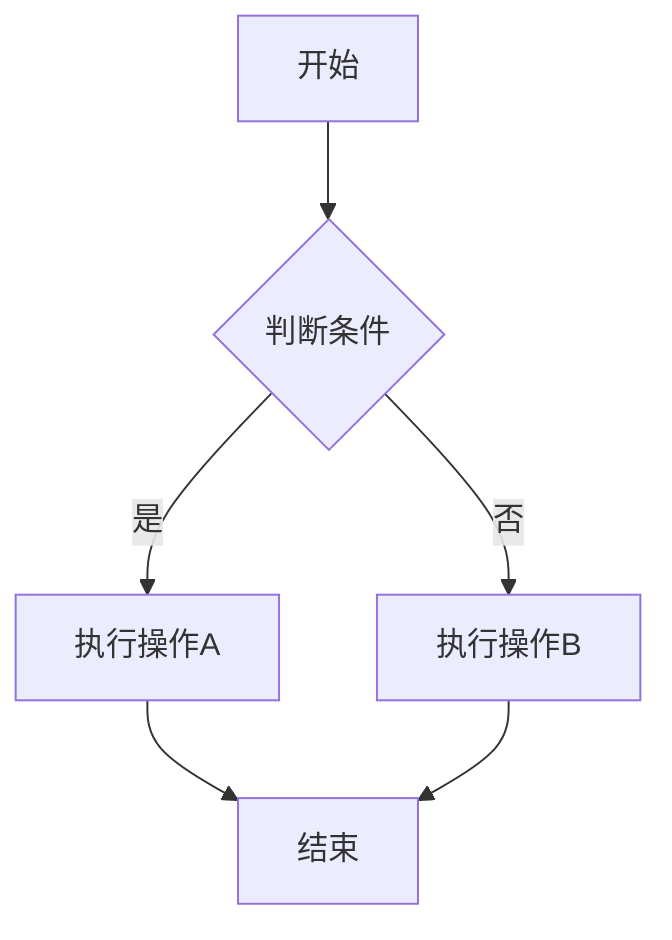

# 流程图

流程图是表达流程和逻辑的常用工具，Opentu 支持 AI 生成流程图和手动绘制。

## 效果展示

只需用文字描述流程，AI 就能自动生成专业的流程图。

## AI 生成流程图

这是最快捷的方式：

### 方法一：自然语言描述

在底部输入框输入流程描述，如：

- "用户登录流程：输入账号密码 → 验证 → 成功进入首页/失败提示重试"
- "订单处理流程：下单 → 支付 → 发货 → 签收"

AI 会理解你的描述并生成相应的流程图。

### 方法二：Mermaid 语法

如果你熟悉 Mermaid 语法，可以更精确地控制流程图：

1. 点击工具栏的 **工具箱** 图标
2. 选择 **Mermaid 转流程图**
3. 输入 Mermaid 代码
4. 点击生成

**示例代码：**

## 手动绘制流程图

<Screenshot id="flowchart-step-1" />

流程图工具

### 第 1 步：添加形状

<Screenshot id="flowchart-step-2" />

选择流程图形状：① 开始/结束 ② 处理步骤 ③ 判断条件

1. 点击工具栏的形状工具
2. 选择需要的形状：
   - **矩形** - 表示操作/步骤
   - **菱形** - 表示判断/条件
   - **椭圆/圆角矩形** - 表示开始/结束
   - **平行四边形** - 表示输入/输出

3. 在画布上点击或拖拽创建

### 第 2 步：添加文字

双击形状，输入说明文字。

### 第 3 步：连接形状

<Screenshot id="flowchart-step-3" />

拖动连接点创建连线，双击编辑文本

1. 按 `A` 键切换到箭头工具
2. 从一个形状拖动到另一个形状
3. 箭头会自动连接两个形状

### 第 4 步：调整布局

拖动形状调整位置，连接线会自动跟随调整。

## 形状含义

| 形状 | 含义 | 使用场景 |
|------|------|----------|
| 圆角矩形 | 开始/结束 | 流程的起点和终点 |
| 矩形 | 处理/操作 | 具体的执行步骤 |
| 菱形 | 判断/决策 | 需要做选择的节点 |
| 平行四边形 | 输入/输出 | 数据的输入或结果输出 |

## 连接线操作

### 添加连接线

1. 选择箭头工具（按 `A` 键）
2. 从起始形状拖到目标形状

### 添加标签

双击连接线，可以添加文字标签（如"是"、"否"）。

### 调整连接点

拖动连接线的端点，可以改变连接位置。

### 折线连接

如果需要拐弯的连接线，选择 **折线箭头** 类型。

## 编辑技巧

### 对齐形状

选中多个形状后，使用对齐功能让它们整齐排列：
- 左对齐 / 右对齐
- 顶部对齐 / 底部对齐
- 水平居中 / 垂直居中

### 等距分布

选中多个形状，使用"等距分布"让间距均匀。

### 复制结构

选中一组形状和连接线，`Ctrl/Cmd + C` 复制，`Ctrl/Cmd + V` 粘贴，可以快速复制相似的结构。

## 快捷键

| 快捷键 | 功能 |
|--------|------|
| `R` | 矩形工具 |
| `O` | 椭圆工具 |
| `A` | 箭头工具 |
| `V` | 选择工具 |
| `双击形状` | 编辑文字 |
| `Delete` | 删除选中项 |

## 小贴士

:::tip
先用 AI 生成基础框架，再手动微调细节，效率最高。
:::

:::tip
流程图太大？选中所有内容，缩小尺寸，或者分成多个子流程图。
:::

:::note
导出为图片时，建议选择 PNG 格式以保持清晰度。
:::
