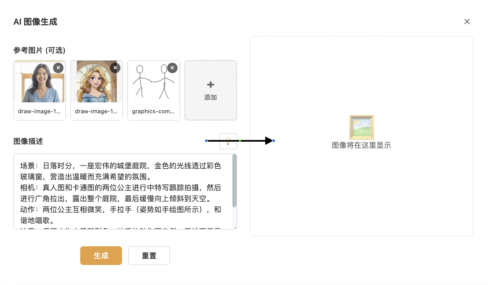

# 用Claude Code构建AI创意工作流：连接nano banana与veo3

## 背景

近半年来，海外最火的三款AI应用或模型：Claude Code（AI编程）、nano banana（AI图像生成）和veo3（AI视频生成）。如何一次过深入体验这三款产品，并创造出更强大的创意工作流呢？

通过深入思考，我发现了一个有趣的连接点：
- **无限画布** 是nano banana的理想应用场景，可以自由组合图片元素和手绘内容
- **AI生成的图片** 是veo3创作视频的优质素材 
- **视频帧提取** 又可以作为新的图片素材，形成创意循环

基于这个洞察，我决定用Claude Code开发一款应用，把nano banana与veo3无缝连接起来。

## 技术选型

选择[Drawnix](https://github.com/plait-board/drawnix)作为基础画布工具进行二次开发。考虑到国内用户访问海外AI服务的门槛，本项目通过[兔子](https://tu-zi.com/)平台提供的实惠方案，兔子平台在AI社区也小有名气。

## 核心功能实现

### 功能一：智能图片组合生成
nano banana的一个杀手级功能是将多个人物图片与手绘姿势结合，生成符合创意需求的合成图片，并且生成的图片和输入图片有非常好的一致性。

**需求**:
1. 快速选择画板上的多个图片元素，显示AI 图片生成按钮，点击，自动填充到表单
2. 将画板中图文以外的所有元素（手绘线条、形状等）导出为图片，作为参考素材
3. 在弹窗上点生成按钮，调用tu-zi提供的API接口生成图片
4. 点击插入，把生成的图片插入到所有选中元素底部+50px像素的位置并垂直居中对齐

**过程与体验**:
Claude Code快速完成了基础版本，但在"导出非图片元素"这个需求上遇到了挑战。来回调试了好几次，生成的图片都有问题，最后告诉它参考导出图片的逻辑实现。成功了！这是体验CC的aha时刻。之后零碎打磨增加了很多小特性：接口调用、异常处理、记录提示词、记录生成历史、生成图片插入的位置等等。前后花了2个多小时。

nano banana 体验：人物完全按所画姿态还原，还是挺震撼的。因为一致性很强，所以需要多个图片融合效果，最好只用人半身图，不含手脚，不然可能手脚不能很好按照手绘图的姿势摆。另外也要跟它强调，生成的图片不要包含手绘图的元素，不然可能生成的图片含手绘内容。

### 功能二：图片生成视频
veo3最让我惊艳的点是，音画同步，可以生成声音和口型一致，并且符合物理逻辑。
**需求**: 
1.选中图片，显示AI 视频生成按钮，点击，打开AI 视频生成弹窗，并自动填充到表单
2. 如果选中的图片上有图文之外的元素，则与图片一起合成一张图片填入表单
3. 在弹窗上点生成按钮，调用tu-zi提供的API接口生成视频
4. 点击插入，把生成的视频插入到所有选中元素底部+50px像素的位置并垂直居中对齐

**过程与体验**:
由于有前面的积累，这部分也很快完成了。中间遇到了2个卡点。有一个展示问题：表单和预览我希望是左右布局的，但CC一直没改对，似乎陷入了某种循环。因为需要改动的地方不多，手工加了几个css属性解决了。另一个是，生图得到的是其他域名的url链接，而这个链接没有带跨域允许，导致使用图形叠加图片绘制新图片时请求跨域报错。这个问题CC也处理了很久，最后，提示它可以用service worker解决，还是很好地解决了。
🎬 **[点击查看图生视频](images/视频1.mp4)**

veo3 体验：音画同步，唱歌还好听，非常赞。仔细看，随时间推移，人脸慢慢和开始长得没那么像了。前阵子看到的在图片上标注箭头可以让主体按箭头方向运动，没体验到，生成的视频里面还保留了标注的箭头，不知道是不是哪里用法不对，知道的小伙伴帮忙回复解答一下。

### 功能三：选择视频帧
veo3只能生成8秒的视频，如果要生成连续的长视频，比较好的方式可能是取最后一帧图片，接着生成下一个视频。
**需求**: 
1.选中视频，显示视频帧选择按钮，点击，打开视频帧选择弹窗。
2.默认选择最后一帧图片显示在弹窗上方，下面可以拖动进度或者输入进准定位到对应时间的帧
3. 点击插入，把视频帧插入到视频元素底部+50px像素的位置并垂直居中对齐

**过程与体验**:
关键的坑前面都踩过了，这个需求实现相对顺畅。
veo3体验：基于视频尾帧生成的视频和前一个视频直接拼接起来会有一点点不连贯。仔细看可以感受得出来，可能需要一点视频剪辑技巧来处理。视频中有事会有些物体突然凭空消失，这也是很多网友吐槽的。但瑕不掩瑜，整体效果还是不错的。

🎬 **[点击查看成品视频](images/成品.mp4)**

### 小结
CC确实称得上是生产力工具了，二开只需要执行`/init`命令，几分钟后就可以开始改代码。人工的话可能还需要花半天去熟悉代码结构与核心逻辑。二开过程中，95%以上的代码都是CC生成的，非常愉快。之前网上很多视频，整一大段完善的提示词，一次过生成完整应用。如果是纯前端，做个demo是可以的。如果要严谨，要处理复杂的逻辑，可能一个需求一个需求地实现，更容易一些。如果这个需求实现有问题，可以先不实现，做下一个需求。而如一次过搞10个需求，中间有两三个bug怎么都过不去，你不知道要保留哪些代码，那这10个需求就白做了，相当于浪费了很多token和时间。另外，我尝试过让CC重构近5天添加的所有代码，花了两多小时，代码不是报错就是功能丢失，最后放弃了。一个文件一个文件进行重构是可以的。

如果让我给CC提一个优化建议，可能是：在需要用户交互或完成的时候，发个提示音。因为你不知道它是1分钟还是10分钟完成，得一直守着电脑。最好能通过微信发个消息，人工回复一个消息可以继续执行下一个任务。更进一步，如果能跟CC视频通话，它把电脑桌面投屏到视频中，可以远程指挥它干活，就完美了，真正实现了远程办公！这也是给Codebuddy Code的建议。

体验地址：[https://ai-tu.netlify.app/](https://ai-tu.netlify.app/)

体验过程中如果遇到接口报错，可以等几秒再试，毕竟需要绕一道，胜在实惠。

github项目：[https://github.com/ljquan/aitu](https://github.com/ljquan/aitu)

欢迎共建与交流，个人微信信号：ljquan
