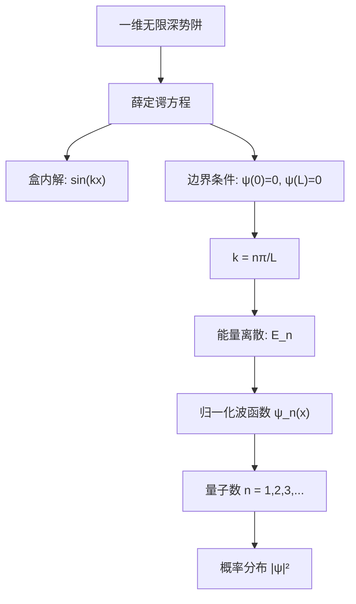

# Mermaid 代码预处理与交互功能

## 概述

`MermaidRenderer` 组件提供两大核心功能：
1. **自动预处理**: 在渲染前自动修复常见的语法问题
2. **点击放大**: 支持点击图表查看大图

## 点击放大功能

### 使用方式

1. 当 Mermaid 图表渲染成功后，将鼠标悬停在图表上
2. 会看到边框高亮和"点击查看大图"提示
3. 点击图表打开全屏预览对话框
4. 在对话框中可以查看完整的大图
5. 点击关闭按钮或按 ESC 键关闭预览

### 交互效果

- **悬停效果**: 鼠标悬停时边框变为品牌色，图表轻微放大（1.02倍）
- **提示信息**: 底部显示放大图标和"点击查看大图"文字
- **预览对话框**: 90% 视口宽度，最大高度 80vh，支持滚动查看超大图表

## 代码预处理功能

`MermaidRenderer` 组件会在渲染前自动预处理 Mermaid 代码，以修复常见的语法问题，特别是处理包含特殊字符的节点标签。

## 自动修复的问题

### 1. 方括号 `[]` 中的特殊字符

**问题**: 方括号中包含冒号 `:`, 逗号 `,`, 等号 `=` 等特殊字符会导致解析错误。

**原始代码**:
```mermaid
A[盒内解: sin(kx)]
B[边界条件: ψ(0)=0, ψ(L)=0]
C[k = nπ/L]
```

**自动转换为**:
```mermaid
A["盒内解: sin(kx)"]
B["边界条件: ψ(0)=0, ψ(L)=0"]
C["k = nπ/L"]
```

### 2. 圆括号 `()` 中的特殊字符

**问题**: 圆括号（圆角矩形）中的特殊字符也会导致问题。

**原始代码**:
```mermaid
A(Go shopping: buy items)
```

**自动转换为**:
```mermaid
A("Go shopping: buy items")
```

### 3. 花括号 `{}` 中的特殊字符

**问题**: 花括号（菱形）中的特殊字符会导致解析错误。

**原始代码**:
```mermaid
C{Let me think: option A, B}
```

**自动转换为**:
```mermaid
C{"Let me think: option A, B"}
```

## 完整示例

### 原始代码（会报错）

```mermaid
graph TB
    A[一维无限深势阱] --> B[薛定谔方程]
    B --> C[盒内解: sin(kx)]
    B --> D[边界条件: ψ(0)=0, ψ(L)=0]
    D --> E[k = nπ/L]
    E --> F[能量离散: E_n]
    F --> G[归一化波函数 ψ_n(x)]
    G --> H[量子数 n = 1,2,3,...]
    H --> I[概率分布 |ψ|²]
```

### 预处理后的代码（正常渲染）



## 特殊字符列表

预处理会自动为包含以下字符的标签添加引号：

- `:` 冒号
- `,` 逗号
- `=` 等号
- `(` `)` 括号
- `|` 竖线
- `/` 斜杠
- `\` 反斜杠

## 已有引号的处理

如果内容已经使用双引号 `"` 或单引号 `'` 包裹，预处理器会跳过，不会重复添加引号。

**示例**:
```mermaid
A["已有引号: 不会修改"]
B['单引号: 也不会修改']
```

## 错误显示

如果预处理后仍然无法渲染，错误提示会显示：

1. **原始代码**: 用户编写的原始 Mermaid 代码
2. **预处理后的代码**: 自动添加引号后的代码（如果有修改）

这样可以帮助用户理解问题所在，并手动调整代码。

## 注意事项

- 预处理是保守的，只处理明确包含特殊字符的标签
- 不会修改 Mermaid 的其他语法元素（如箭头标签、注释等）
- 已正确格式化的代码不会被修改
